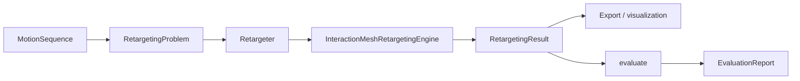

# Architecture

The public API is organized around immutable inputs and typed outputs:

- `RetargetingProblem` describes the robot, motion, scene, solver, objectives, and constraints.
- `Retargeter` executes the run and returns `RetargetingResult`.
- Registries hold motion formats, robots, objective terms, constraint terms, solvers, metrics, and visualizers.
- Heavy backends such as MuJoCo, CVXPY, and Viser are optional and isolated behind protocols.

Related references: [Interaction mesh](interaction-mesh.md), [Result schema](result-schema.md), [Registries](api/registries.md), [Ecosystem](ecosystem/index.md).

## Retargeting Core

`Retargeter` prepares the problem (including optional `output_fps` resampling) and delegates frame optimization to `InteractionMeshRetargetingEngine`. When `RetargetingProblem.output_fps` is set, `Retargeter.run` calls `with_output_fps_applied()` so motion and dynamic object trajectories are resampled before optimization; the saved result frame count matches the requested rate. `engine.run` expects that prepared problem and does not resample again.

The default engine is `InteractionMeshRetargetingEngine`. It uses the `RetargetingProblem.mesh` spec to configure `InteractionMeshBuilder`, defaulting to Delaunay topology with deterministic fallback. A custom engine-level builder can still override the problem spec for programmatic sweeps. The default solver mode is `auto`: it uses CVXPY/Clarabel when the optimize extra is installed and falls back to the deterministic NumPy/SciPy solver otherwise. For each frame it:

1. Scales the input motion to the target robot when requested.
2. Builds an interaction mesh from mapped human joints and object, terrain, or ground sample points.
3. Computes source Laplacian coordinates in the task frame.
4. Queries a kinematics backend for robot point positions and Jacobians.
5. Runs an SQP inner loop: lowers registered objective and constraint terms into a local quadratic subproblem over actuated-joint increments, solves it (joint limits, trust region, foot-contact locking, explicit foot-lock windows, ground non-penetration, scene clearance, and backend self-collision when enabled), and repeats until the increment norm is below tolerance or `max_iterations` is reached.
6. Advances to the next frame, warm-starting actuated joints from the previous solution.

The fixture backend is deterministic and dependency-light so tests and examples run without robot assets. `MuJoCoKinematicsBackend` provides body positions, translational/rotational Jacobians, qpos/qvel conversion, position integration, joint range extraction, and geom-distance hooks behind the same protocol; stricter collision constraints and simulator-specific metrics can be layered behind that backend without changing the high-level problem/result schema.

### Foot contact

Per-frame stance for `foot_contact` and `foot_lock` comes from either explicit labels on the motion or velocity inference at run time. When `MotionSequence.contacts` is populated, those dictionaries are used directly (filtered to the motion format’s `contact_joints`). When contacts are absent, the engine calls `infer_contact_by_velocity` on contact-joint speeds. Load contacts with your motion format ([Add a motion format](adding-a-motion-format.md)); tune thresholds via constraint `parameters` ([Adding objectives and constraints](adding-objectives-constraints.md)).

## Command Line

The CLI uses Typer for typed, workflow-oriented subcommands and Rich for readable tables, summaries, and diagnostics. Typer owns command parsing only; the commands immediately construct typed package objects such as `RetargetingProblem`, `RetargetingResult`, and `AssetStore`.

Single-run CLI jobs can also be loaded from TOML, YAML, or JSON. Those files are deserialized into `RetargetingRunConfig`, resolved through registries, and then converted into the same `RetargetingProblem` used by the Python API.

Batch CLI jobs use `BatchRunner`, `BatchJob`, and `BatchManifest` from `retarget.pipeline`. The runner owns resume behavior and process-pool execution while the CLI only builds jobs and prints a Rich summary.

Core models and solvers avoid terminal concerns so they remain usable from notebooks, services, and other libraries.

Evaluation (`retarget evaluate`, `evaluate_result`) loads a `RetargetingResult`, optionally aligns a `RetargetingProblem` to the result time grid, and returns an `EvaluationReport` with metric values—it is a separate post-run step, not part of `Retargeter.run`.
