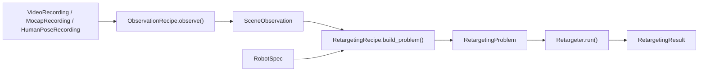

# Architecture

The design separates facts observed in the world from choices made for a target
robot.



`RetargetingExperiment` owns this orchestration. It accepts either an
`ObservationRecipe` or an existing `SceneObservation`, so expensive capture
processing can be inspected, checkpointed explicitly, and reused with several
robots or adaptation recipes.

## Native Recordings

Each recording owns its native `SampleTimeline`, frame convention, enum
vocabulary, validity masks, and provenance:

- `VideoRecording`
- `MocapRecording`
- `HumanPoseRecording`
- `PointTrack`, `PoseTrack`, `CategoricalTrack`, and their specialized track types

Recordings do not pretend to share a clock. `ClockTransform` represents the
estimated affine mapping between clocks. Point tracks interpolate linearly, pose
tracks use SLERP, and categorical tracks use nearest-neighbor sampling.
Registration failures raise `AlignmentError` carrying the rejected
`AlignmentReport`; there is no zero-lag fallback.

Fusion recipes declare `TimelineSelection` and `CropPolicy` directly.
Skateboarding can retain the human-pose grid, retain the transformed mocap
grid, or construct an explicit uniform grid. Selecting `UNIFORM` also requires
`uniform_fps`; no global timing constant chooses this implicitly.

## Scene Observation

`SceneObservation` is the canonical target-independent output of capture
processing. It has one timeline and world frame, actor motion, semantic
landmarks, rigid bodies, observed objects, semantic contacts, support geometry,
alignment reports, and provenance-only metadata.

`SemanticContactSequence` names subjects, patches, and states. It does not name
robot links. Link resolution happens only in the adaptation recipe.

Checkpoints are explicit:

```python
observation.save_npz("observation.npz")
restored = SceneObservation.load_npz("observation.npz")
```

No recipe writes a stage file or cache automatically.

## Robot Adaptation

Source vocabularies subclass `MotionJoint`, `MocapRigidBody`,
`ObservationRole`, `ContactSubject`, `ContactState`, and `ContactPatch`.
Robots declare a `RobotRole` vocabulary and bind those roles to concrete joints,
links, and link groups through `RobotSpec`.

Adaptation recipes map observation or motion enum members to robot-role enum
members. They then create the robot-resolved `MotionSequence`, `ContactPlan`,
`LinkTargetPlan`, scene, objective profile, and constraints. There are no
side-name heuristics or default source-name mappings in the optimization core.
Workflow-specific numeric behavior belongs in typed policy objects such as
`HolosomaClimbObservationPolicy` and `HolosomaClimbOptimizationPolicy`, not in
vocabulary or metadata dictionaries.

## Retargeting Core

`Retargeter` applies optional output-rate resampling and delegates to
`InteractionMeshRetargetingEngine`. The engine builds the configured interaction
mesh, queries the selected kinematics backend, and lowers typed objective and
constraint configs into a local quadratic problem for each SQP iteration.

Heavy integrations such as MuJoCo, CVXPY, Viser, Torch, SMPL-X, ROS bag readers,
and GVHMR execution remain optional behind protocols or source implementations.

## Declarative Runs

Run configs serialize constructor arguments for the same public hierarchy:

```toml
[observation]
kind = "motion_file"

[recipe]
kind = "role_mapping"
```

`RetargetingRunConfig.build_experiment()` returns a `RetargetingExperiment`.
The CLI does not have a separate preparation or synchronization workflow.
