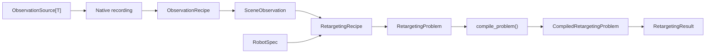

# Architecture

`retarget` has one typed path from native capture to backend execution:



`RetargetingExperiment` composes observation, adaptation, and execution. It
accepts either an `ObservationRecipe` or an existing `SceneObservation`, so an
expensive fused observation can be inspected, explicitly checkpointed, and
retargeted to several robots.

## Typed Domain Layer

Semantic names are enum members in public Python objects. User vocabularies
subclass empty extension bases:

- `MotionJoint`, `RobotJoint`, `RobotLink`, and `RobotGeometry`
- `ObservationRole` and `RobotRole`
- `ContactSubject`, `ContactState`, and `ContactPatch`

Registry extensions use the same pattern through `ObjectiveKind`,
`ConstraintKind`, `SolverKind`, `RobotKind`, `MotionFormatKind`, and the other
registry-key bases. A member from a different enum class is rejected even when
its string value is equal.

`MotionSequence[JointT]`, `RobotVocabulary`, `RobotSpec`, `ContactPlan`, and
`LinkTargetPlan` preserve those concrete enum classes. Recipes bind source
members to robot roles; `RobotSpec` resolves roles to concrete robot members.
No optimizer component guesses left/right, foot, hand, pelvis, or geometry
meaning from a name.

## Native Capture

`VideoRecording`, `MocapRecording`, and `HumanPoseRecording` each own a native
`SampleTimeline`, coordinate frame, typed tracks, validity masks, and
provenance. They do not pretend to share a clock.

Observation recipes compose:

- `ClockTransform` and typed temporal registration
- track-owned interpolation
- frame conversion and rigid spatial registration
- semantic landmarks, observed objects, contacts, and support geometry

The canonical fused result is `SceneObservation`. There is no synchronization
API and no required synchronized archive. `SceneObservation.save_npz()` is an
explicit optional checkpoint, never an automatic handoff.

## Compilation Boundary

Strings and numeric indices appear once, at backend compilation:

```text
RetargetingProblem[typed vocabularies]
-> compile_problem(...)
-> CompiledRetargetingProblem[names, indices, arrays]
-> KinematicsBackend / solver
```

Compilation validates every referenced joint, link, body alias, and geometry.
Geometry pairs are always explicit. The simple backend uses
`SimpleKinematicPoint` declarations from the robot spec; it does not derive
kinematics from semantic names.

External identifiers remain strings only where the external system requires
them, such as MuJoCo body aliases, filesystem paths, ROS topics, and serialized
config values.

## Persistence

`SceneObservation` and `RetargetingResult` use strict, pickle-free NPZ schemas.
Enum vocabularies and registry members are recorded with qualified module,
class, member, and value identity where reconstruction is required. Behavioral
state lives in typed fields and structured reports. Free-form `provenance`
contains origin, source files, versions, and processing history only.

## Declarative Runs

TOML, YAML, and JSON configs are serialization frontends over the same objects:

```toml
[observation]
kind = "motion_file"

[recipe]
kind = "role_mapping"
```

`RetargetingRunConfig.build_experiment()` returns a
`RetargetingExperiment`. Serialized strings are resolved through registered
enum members before the experiment is built; unknown keys fail during config
preflight.
