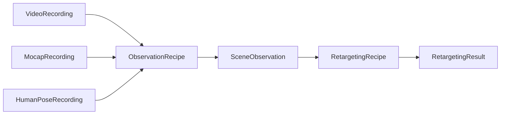

# Capture System

Capture processing is part of `retarget`, not a neighboring pipeline.

Sources load one native modality. Recipes decide which modalities are required
and how they are registered. Normal experiment code does not call a
synchronization API or load a synchronized archive.

| Layer | Public abstractions |
|---|---|
| Native data | `SampleTimeline`, recording and track models |
| Loading | `ObservationSource[T]`, Vicon, GVHMR, video-pose, in-memory sources |
| Fusion | `ObservationRecipe`, `ClockTransform`, registration strategies |
| Inspection | `SceneObservation`, explicit `save_npz` / `load_npz` |
| Robot adaptation | `RetargetingRecipe`, `RobotSpec`, semantic robot roles |
| Execution | `RetargetingExperiment`, `Retargeter` |

See [End-to-end pipeline](pipeline.md) for skateboarding and [Custom schemas](custom-schemas.md)
for new sensor vocabularies.
