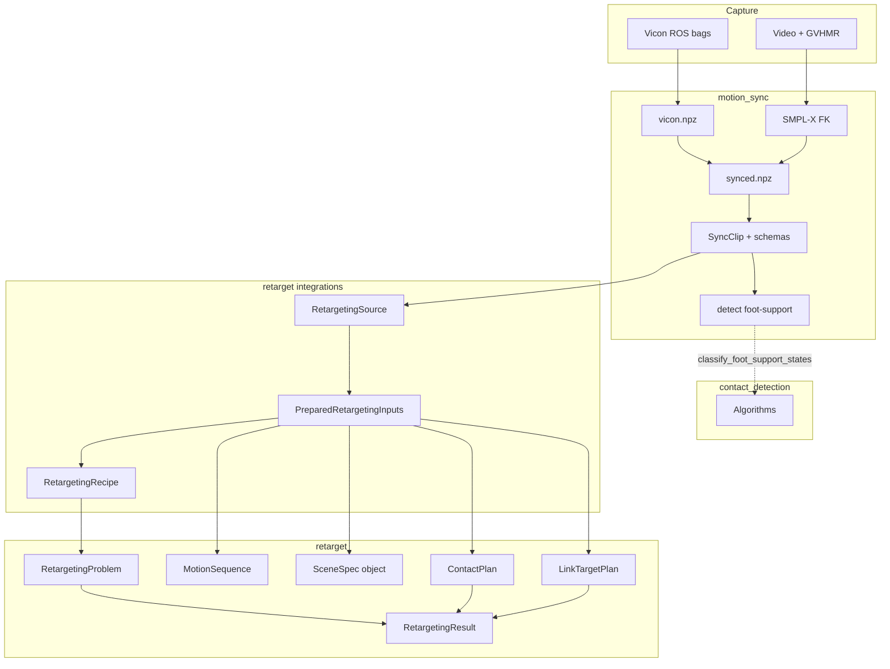

# Research ecosystem

`retarget` is the **robot retargeting** library. Real lab clips are usually built in two companion repositories that run **before** you call `Retargeter`:

| Repository | Package / CLI | Responsibility |
|------------|---------------|----------------|
| [motion_sync](https://github.com/ryanrudes/motion_sync) | `motion_sync`, `motion-sync` | Ingest Vicon + GVHMR, time-sync, typed **`SyncClip`**, persist **`synced.npz`** |
| [contact_detection](https://github.com/ryanrudes/contact_detection) | `contact_detection` | Foot-support **algorithms** (air / ground / board); no clip I/O |
| **retarget** (this site) | `retarget` | `MotionSequence` + `SceneSpec` → `RetargetingResult` |

!!! note "contact_detection naming"
    GitHub repo: **[contact_detection](https://github.com/ryanrudes/contact_detection)**. Python package: `contact_detection`. Retarget submodule path: `vendor/event_detection`. Local clone folder name is arbitrary (often `event_detection`).



## Where documentation lives

**This site** is the single entry point:

- [Workspace setup](workspace-setup.md) — submodules for docs, sibling clones for pipeline dev
- [End-to-end pipeline](pipeline.md) — skateboarding example from bags to `retarget run`
- [Custom schemas](custom-schemas.md) — define bodies, markers, video joints, and contacts for a **new** experiment
- [motion_sync API](../api/motion-sync.md) and [contact_detection API](../api/contact-detection.md) — generated from sibling packages when present

Each repo also has a short **README** for CLI-only use without the full site.

## Submodules vs sibling clones

**retarget** ships git submodules at `vendor/motion_sync` and `vendor/event_detection` so `mkdocs build` and API reference pages work from a single clone (`git clone --recurse-submodules`).

**Recommended for daily pipeline work:** also clone **motion_sync** and **contact_detection** **side by side** with editable installs—submodule trees are not meant to hold trial `output/` or SMPL-X weights.

```text
~/GitHub/
  retarget/          # docs + submodules under vendor/
  motion_sync/       # bags → synced.npz, detect
  event_detection/   # contact_detection package (folder name optional)
```

## One timeline, many views

The design goal is **one clip, one timeline, many registered views**:

| View | Register | Read |
|------|----------|------|
| Vicon rigid bodies | `MocapSchema` / `register_mocap` | `clip.body(Bodies.LEFT_SHOE)` |
| Per-body markers | same | `clip.marker(LeftShoeMarkers.HEEL)` |
| Video / SMPL-X joints | `VideoSchema` / `register_video` | `clip.joint(SmplxCoreJoints.L_FOOT)` |
| Contacts | `ContactSchema` / `register_contacts` | `clip.contact(SKATE_FOOT_SUPPORT)` |

`retarget` core never reads `synced.npz` directly. Integration adapters such as `retarget.integrations.motion_sync.skateboarding` adapt a `SyncClip` into `MotionSequence`, `SceneSpec`, `ContactPlan`, and `LinkTargetPlan` before building the problem.
