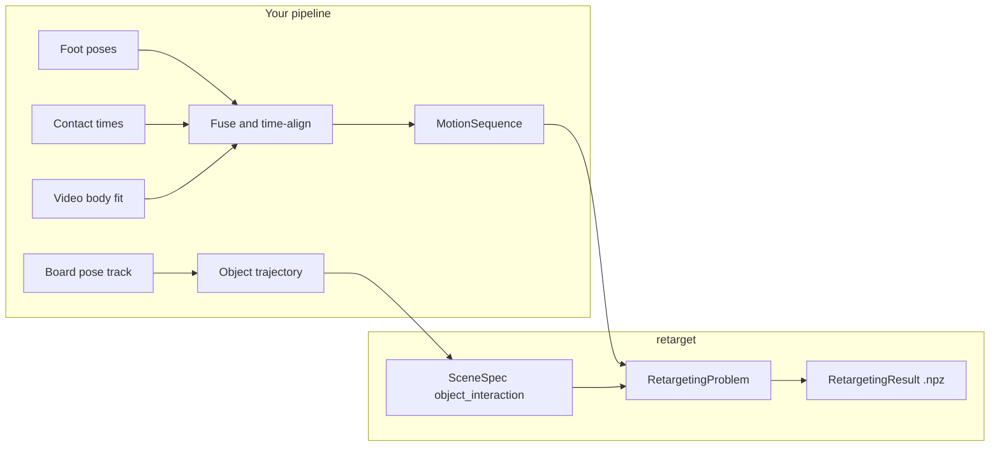

# Introduction: a research use case from square one

This page walks through a **complete research-style project**—retargeting a human skateboarding onto a robot while a moving skateboard constrains foot placement. It is the map the rest of the docs assume you already have: which decisions come first, what you build outside `retarget`, and what you hand to the library.

If you have not installed the toolkit yet, run [Quickstart](quickstart.md) first (`uv sync`, `retarget doctor`, one fixture run). Then return here.

Lab capture and time sync live in **[motion_sync](https://github.com/ryanrudes/motion_sync)** (Python package `motion_sync`, CLI `motion-sync`) with foot-support algorithms in **[contact_detection](https://github.com/ryanrudes/contact_detection)** (Python package `contact_detection`; local clone folders are often named `event_detection`). See the [Ecosystem](ecosystem/index.md) section for workspace layout, [custom schemas](ecosystem/custom-schemas.md), and the [full pipeline](ecosystem/pipeline.md).

Runnable scripts for this walkthrough live in `examples/skateboarding/`.

## The scenario

You want robot joint trajectories that reproduce a skate clip. Your measurements look like this:

| Signal | Typical source | Role in retargeting |
|--------|----------------|---------------------|
| Foot 3D positions | Mocap, multi-view triangulation, or SLAM + IK | High-trust targets in the human motion |
| Foot contact times | Force plates, contact classifiers, or heuristics | Stance locking and foot-slide metrics |
| Skateboard pose | Object tracking or calibrated rig | Moving scene geometry (`ObjectSpec` trajectory) |
| Upper body | Video pose (SMPL-X fit, 2D keypoints lifted to 3D) | Lower-trust body shape; still part of the mesh |

`retarget` does **not** ingest raw video or separate contact detectors. You **fuse** sensors into two typed inputs:

1. **`MotionSequence`** — human joint positions (and optional per-frame contacts) on a fixed skeleton.
2. **`SceneSpec`** — ground samples plus, for this task, a **moving object** (the deck).

Everything else is configuration: robot, format, objectives, constraints, solver.



## Step 1 — Choose the task kind

`TaskKind` is the first fork. It decides which geometry enters the interaction mesh.

| Task kind | Use when |
|-----------|----------|
| `robot_only` | Locomotion on flat ground; no prop |
| **`object_interaction`** | **Hands or feet interact with a moving rigid prop** — carrying a box, pushing a cart, **riding a board** |
| `climbing` | Feet/hands on fixed terrain samples (walls, holds) |

A skateboard is a **moving rigid object** relative to the world, so choose **`object_interaction`**, not `robot_only` or `climbing`.

See [Scenes and task kinds](tutorials/scene-tasks.md) for runnable object and terrain examples.

## Step 2 — Choose a motion format (skeleton contract)

A **motion format** is a named contract: ordered `joint_names`, `root_joint`, optional `contact_joints`, frame convention, and default height/FPS. Files are parsed **through** that contract into a `MotionSequence`.

List what is registered:

```bash
uv run retarget doctor
```

For skateboarding with a full body from video, **`smplx`** or **`smplh`** are the usual starting points (global joint positions in meters). Foot contact labels must use the format’s contact joint names—for `smplx`, that is `L_Foot` and `R_Foot`; for `smplh` / `minimal`, toe names like `L_Toe` / `R_Toe`.

If your skeleton naming does not match any built-in format, register a custom one ([Add a motion format](adding-a-motion-format.md), `examples/custom_motion_format.py`).

!!! warning "One array, fixed joint list"
    `MotionSequence` requires `joint_positions` with shape `(frames, joints, 3)` for **every** joint in the format. The library does not accept per-joint NaNs or confidence weights. Noisy upper-body video should be cleaned **before** retarget (better SMPL fit, temporal smoothing, or holding weak joints near a prior). Feet and board can still dominate behavior via contact labels and scene clearance.

## Step 3 — Time-align and build `MotionSequence`

All streams must share the same frame index and `fps`:

1. Resample foot poses, body joints, and board pose to one timeline.
2. Convert coordinates to the format’s declared frame (loaders convert to internal **Z-up right-handed**; see [Coordinate conventions](coordinate-conventions.md)).
3. Pack joint positions in the format’s joint order.
4. Attach **explicit contacts** when you have them.

### Contact labels

The optimizer consumes typed `ContactPlan` data. Legacy per-frame dictionaries such as `{"L_Foot": True, "R_Foot": False}` are still accepted by loaders and converted at the CLI boundary, but new integrations should build `ContactPlan` directly.

Built-in loaders accept contacts in JSON/NPZ/CSV:

=== "JSON (excerpt)"

    ```json
    {
      "name": "kickflip_clip_01",
      "fps": 60,
      "joint_names": ["Pelvis", "L_Hip", "..."],
      "joint_positions": [[[...], ...], ...],
      "contacts": [
        {"L_Foot": true, "R_Foot": true},
        {"L_Foot": true, "R_Foot": false}
      ]
    }
    ```

=== "NPZ keys"

    - `joint_positions` or `global_joint_positions` — `(T, J, 3)`
    - `contacts` or `contact_states` — `(T, C)` booleans
    - `contact_names` — length `C` (defaults to the format’s `contact_joints`)

=== "CSV columns"

    - `{JointName}_x`, `{JointName}_y`, `{JointName}_z` for positions
    - `{JointName}_contact` or `contact_{JointName}` for stance flags

Full loader rules: [Add a motion format](adding-a-motion-format.md).

### Python assembly

`retarget.integrations.motion_sync.skateboarding.SkateboardingClipSource` is the typed bridge from ecosystem output to retargeting intermediates. `SkateboardingRetargetingRecipe` then turns that source into a complete `RetargetingProblem`. The runnable example uses that recipe path:

```bash
uv run python examples/skateboarding/run_retarget.py --demo pushoff5_twoshoes
```

The source loads `motion_sync_output/synced/<demo>/synced.npz` with `SKATE_SESSION`, refreshes `SKATE_FOOT_SUPPORT` when the stored contact layer is stale, and returns a `PreparedRetargetingInputs` bundle:

- `motion` — SMPL-X core joints, root poses, source height, and provenance.
- `scene` — skateboard object trajectory and deck samples.
- `contacts` — typed foot-support states and support plane.
- `targets` — named link-tracking targets.

The recipe adds the reusable optimization profile: link tracking, smoothness, nominal tracking, joint limits, trust region, foot sticking, and scene-point non-penetration against the skateboard samples. Run configs are declarative frontends over this same typed path; `[source] kind = "motion_sync_skateboarding"` selects the registered source builder rather than a separate retargeting workflow.

The target plan includes per-frame link targets:

- Mocap shoe positions drive `left_ankle_roll_link` and `right_ankle_roll_link`, with higher weights during detected stance.
- Video SMPL-X hips, knees, and ankles guide the rest of the lower body.
- An upper-body center-of-mass proxy guides `torso_link`; smoothness and `nominal_tracking` keep the upper body near a regular posture.

The adapter converts video FK joints from **Y-up to Z-up** before aligning them to the Vicon lab frame (see [Coordinate conventions](coordinate-conventions.md)).

### Real clip example (`pushoff5_twoshoes`)

Bootstrap robot assets once, then run the programmatic example from the repository root:

```bash
uv run python scripts/bootstrap_robot_assets.py g1 --store .retarget_assets
uv run python examples/skateboarding/run_retarget.py --demo pushoff5_twoshoes
uv run retarget view \
  --result examples/skateboarding/generated/pushoff5_twoshoes/pushoff5_twoshoes_retarget.npz \
  --live \
  --robot-spec .retarget_assets/robot/g1/robot.toml
```

`run_retarget.py` uses MuJoCo kinematics when the optional stack is installed and the downloaded G1 XML is available:

```bash
uv sync --extra mujoco
uv run python examples/skateboarding/run_retarget.py --demo pushoff5_twoshoes --kinematics mujoco
```

Optional `root_poses` improve root initialization when your tracker provides global pelvis pose.

## Step 4 — Model the skateboard in the scene

Under `object_interaction`, the scene contains:

- **Ground** sample points (a grid under the rider).
- **`ObjectSpec`** — sample points on the deck (object frame) plus a per-frame **`ObjectTrajectory`**.

Sample points approximate deck shape for clearance and mesh coupling. They can be:

- A small explicit point cloud (bounding box corners work for prototyping),
- Points sampled from a deck mesh (`mesh_path` + `mesh_sample_count` in a run config),
- A `.npy` / `.npz` file referenced by `sample_points_path`.

The board pose track becomes `ObjectTrajectory.poses` — a `PoseSequence` parallel to the motion. In a run config:

```toml
task_kind = "object_interaction"

[scene]
ground_size = 12
ground_range = [-2.0, 2.0]

[scene.object]
name = "skateboard"
sample_points_path = "deck_samples.npy"
trajectory_path = "board_trajectory.npz"
```

Trajectory files may be `.npy`, `.npz`, `.json`, or `.csv` with positions and optional quaternions (see [Add objectives or constraints](adding-objectives-constraints.md)). Missing rotations default to identity.

The skateboarding adapter builds deck samples and the board trajectory from Vicon data in memory.

Object points move with the trajectory each frame; robot links are checked for clearance in the object frame.

## Step 5 — Pick a robot and joint mapping

`RetargetingProblem` needs a `RobotSpec` (built-in name, spec file, or asset store). The engine maps **human motion joints → robot links** via `robot.default_link_mapping` / `default_joint_mapping`, optionally overridden with `joint_mapping` on the problem.

Only joints that appear in **both** the motion and the mapping drive the interaction mesh. For a real G1 run, bootstrap the Holosoma-derived asset-backed spec:

```bash
uv run python scripts/bootstrap_robot_assets.py g1 --store .retarget_assets
```

The generated `.retarget_assets/robot/g1/robot.toml` includes URDF/MJCF paths, joint limits parsed from the URDF, contact links, and SMPL-X link mappings. Extend or replace mappings when your format uses different names ([Add a robot](adding-a-robot.md)).

## Step 6 — Objectives, constraints, and profiles

The default engine lowers registered terms into a per-frame quadratic subproblem. For object interaction, start from **`OptimizationProfile.object_interaction()`** when tuning real contacts. The skateboarding example builds a custom profile in `examples/skateboarding/run_retarget.py`.

| Term | What it does for skate |
|------|-------------------------|
| `laplacian` | Preserves body–board–ground spatial relationships from the human motion |
| `link_tracking` | Tracks named robot links to mocap/video/COM targets stored in `LinkTargetPlan` |
| `smoothness` | Reduces jitter frame-to-frame |
| `nominal_tracking` | Keeps the upper body near a regular posture while lower-body targets dominate |
| `foot_sticking` / `foot_lock` | Respects typed stance windows and support planes |
| `non_penetration` | Keeps feet and board from interpenetrating via support-plane and deck sample-point sources |

Tune weights in a run config (`[[objectives]]`, `[[constraints]]`) so foot and scene terms are not drowned out by smoothness. Term reference: [Add objectives or constraints](adding-objectives-constraints.md).

## Step 7 — Freeze a reproducible run config

Once paths and weights stabilize, capture the experiment in TOML/YAML ([Run configs](tutorials/run-configs.md)). The skateboarding `run_config.toml` uses paths relative to `examples/skateboarding/`, so call it from the repository root or keep those generated paths intact:

```bash
uv run retarget run --config examples/skateboarding/run_config.toml
uv run retarget evaluate \
  --result examples/skateboarding/generated/pushoff5_twoshoes/pushoff5_twoshoes_retarget.npz \
  --config examples/skateboarding/run_config.toml
```

Pass the **same `--config`** to `evaluate` when metrics need scene geometry (for example penetration against the deck samples).

## Step 8 — Evaluate and iterate

`retarget evaluate` writes scalar metrics (optimization cost, foot sliding proxies, and others). Use them to compare contact thresholds, clearance, and smoothness weights across clips.

From `examples/skateboarding/`, pass the **same config** you used for `retarget run` when the run config defines scene geometry:

```bash
uv run retarget evaluate \
  --result examples/skateboarding/generated/pushoff5_twoshoes/pushoff5_twoshoes_retarget.npz \
  --config examples/skateboarding/run_config.toml
```

Typical iteration loop:

1. Fix time alignment or contact labels in upstream fusion.
2. Re-run with adjusted typed objective or constraint config fields.
3. Inspect `RetargetingResult.qpos` and provenance metadata ([Result schema](result-schema.md)).
4. Preview with `retarget view` ([Export and view](tutorials/export-and-view.md)).

Scale to many clips with [Batch and metrics](tutorials/batch-and-metrics.md).

## Runnable learning slice

From the repository root:

```bash
uv sync --extra dev
git submodule update --init
uv run python examples/skateboarding/run_retarget.py --demo pushoff5_twoshoes --download-assets
uv run retarget evaluate \
  --result examples/skateboarding/generated/pushoff5_twoshoes/pushoff5_twoshoes_retarget.npz \
  --config examples/skateboarding/run_config.toml
```

This runs the skateboarding example against local synced data and an asset-store G1 robot spec. Live playback requires the URDF-backed robot spec.

For a static box without a board trajectory, see `examples/object_interaction.py`. For human-only retargeting, use [Your first retarget](tutorials/your-first-retarget.md).

## What this toolkit does not model

Be explicit about scope when planning papers or demos:

- **No raw video or 2D keypoint API** — pose estimation stays upstream.
- **No per-joint measurement noise** — only uniform objective weights and cleaner inputs.
- **No skate physics** — no wheel roll, truck compliance, or rider–board dynamics beyond mesh preservation and clearance constraints.
- **Collision fidelity depends on backend** — full MuJoCo separation requires the optional kinematics backend; the fixture backend is lighter.

## Checklist before your first real clip

- [ ] `task_kind = object_interaction` with board `ObjectSpec` + trajectory
- [ ] Motion format matches your skeleton names; contacts use that format’s `contact_joints`
- [ ] All streams share `fps` and frame count (motion, contacts, board poses)
- [ ] Coordinates converted to meters, Z-up internally after load
- [ ] Robot mapping covers feet (and any other joints you care about)
- [ ] Run config saved; evaluate uses the same scene context

## Where to go next

| Goal | Page |
|------|------|
| Install and one-line smoke test | [Quickstart](quickstart.md) |
| Hands-on CLI and `.npz` inspection | [Tutorials](tutorials/index.md) |
| Engine and mesh mental model | [Architecture](architecture.md) |
| Frames, resampling, root poses | [Coordinate conventions](coordinate-conventions.md) |
| Custom skeletons and loaders | [Add a motion format](adding-a-motion-format.md) |
| Lab robots and manifests | [Assets](assets.md) |
| API types | [API](api/index.md) |
