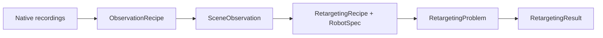

# Capture To Retarget

Capture processing and retargeting are one library and one experiment path.

Normal experiment code does not call a synchronization API and does not load a
pre-synchronized archive. Sources load native modalities; observation recipes
own temporal registration, resampling, frame conversion, spatial registration,
object reconstruction, and semantic contact derivation.

See [End-to-end workflows](workflows.md), [Native schemas](schemas.md), and
[Workspace setup](workspace.md).
