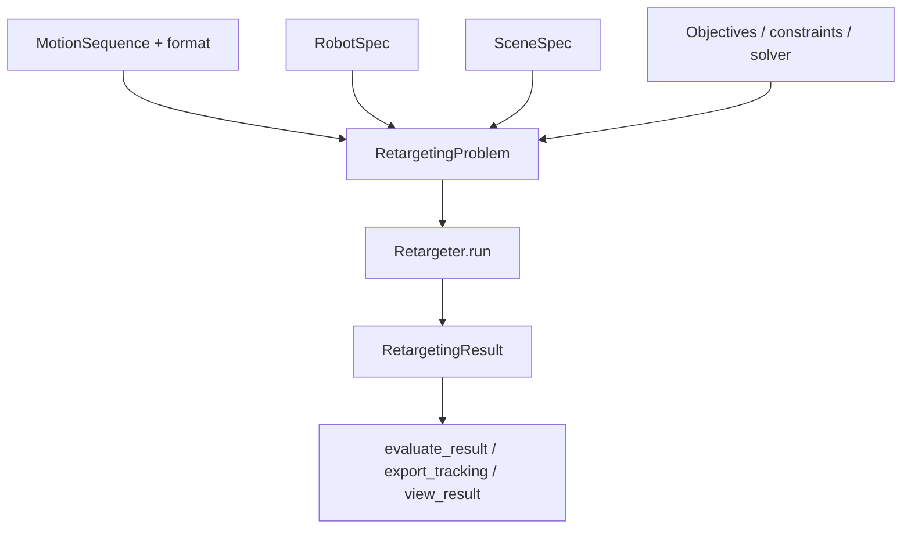

# Python API

The public surface centers on immutable specs, a single runner, and registries for plugins. This tutorial mirrors the CLI flow in pure Python and shows where to hook custom logic. For the engine-level pipeline diagram, see [Architecture](../architecture.md). Step 4 of [Your first retarget](your-first-retarget.md) walks through the same `Retargeter` / `RetargetingProblem` flow with the tutorial fixture.

!!! tip "Jump to API definitions"
    Hover recognized `retarget` names in a code block for the API badge tooltip; click to open the autogenerated API entry.

## Core objects



| Type | Role |
|------|------|
| `MotionSequence` | Source human joint trajectories |
| `RobotSpec` | Target skeleton, limits, link mapping |
| `SceneSpec` | Ground, object, or terrain geometry |
| `RetargetingProblem` | Full immutable problem description |
| `Retargeter` | Executes the default interaction-mesh engine |
| `RetargetingResult` | Output `qpos`, costs, provenance |

Import from the package root for ergonomics:

```python
from retarget import Retargeter, RetargetingProblem, SceneSpec, TaskKind
```

For the minimal robot-only script, see [Your first retarget — Step 4](your-first-retarget.md#step-4--same-job-in-python) and `examples/basic_robot_only.py`.

Pytest runs a fixed set of example scripts from a temporary working directory (`tests/test_examples.py`: `basic_robot_only.py`, `batch_and_evaluate.py`, `climbing_terrain.py`, `custom_motion_format.py`, `custom_objective.py`, `custom_robot.py`, `object_interaction.py`, `skateboarding/run_retarget.py`). Keep those scripts self-contained and free of repo-local output assumptions.

## Load config files in Python

Reuse CLI run specs for notebooks and tests:

```python
from pathlib import Path

from retarget import Retargeter
from retarget.cli.config import RetargetingRunConfig

config = RetargetingRunConfig.load(Path("examples/run_config.toml"))
problem = config.build_problem()
result = Retargeter().run(problem)
result.save_npz("from_config.npz")
```

`RetargetingRunConfig` resolves relative motion and mesh paths against the config directory.

## Evaluation and export

```python
from retarget.metrics import evaluate_result
from retarget.export import ExportSpec, export_tracking
from retarget.results import RetargetingResult

result = RetargetingResult.load_npz("basic_robot_only.npz")
report = evaluate_result(result, problem=None)  # pass problem for scene-aware metrics
print(report.metrics)

export_tracking(
    result,
    ExportSpec(format_name="mujoco_npz", output_path="tracking.npz"),
)
```

Pass a `KinematicsBackend` in `ExportSpec` when `qvel` must match MuJoCo’s layout—see [Export and view](export-and-view.md).

## Registries and extension points

Discover or fetch plugins by name:

```python
from retarget.robots import robots
from retarget.motion import motion_formats
from retarget.optimization import objective_terms, constraint_terms

print(robots.names())
print(motion_formats.names())
print(objective_terms.names())
```

Register new robots, formats, objectives, or constraints in your package or a local module imported before `Retargeter().run`. The extending guides cover each registry:

- [Add a robot](../adding-a-robot.md)
- [Add a motion format](../adding-a-motion-format.md)
- [Add objectives and constraints](../adding-objectives-constraints.md)

`examples/custom_objective.py` shows a small custom objective term.

## Invoke the CLI from Python

Batch orchestration can call the same entrypoint as the shell:

```python
from retarget.cli.main import main

main(["run", "--motion", "tests/fixtures/minimal_motion.json", "--format", "minimal",
      "--robot", "synthetic_humanoid", "--output", "cli_via_python.npz"])
```

See `examples/batch_and_evaluate.py` for batch and evaluate sequences.

## Next steps

- [Batch and metrics](batch-and-metrics.md) — scale to datasets
- [API reference](../api/index.md) — autogenerated signatures
